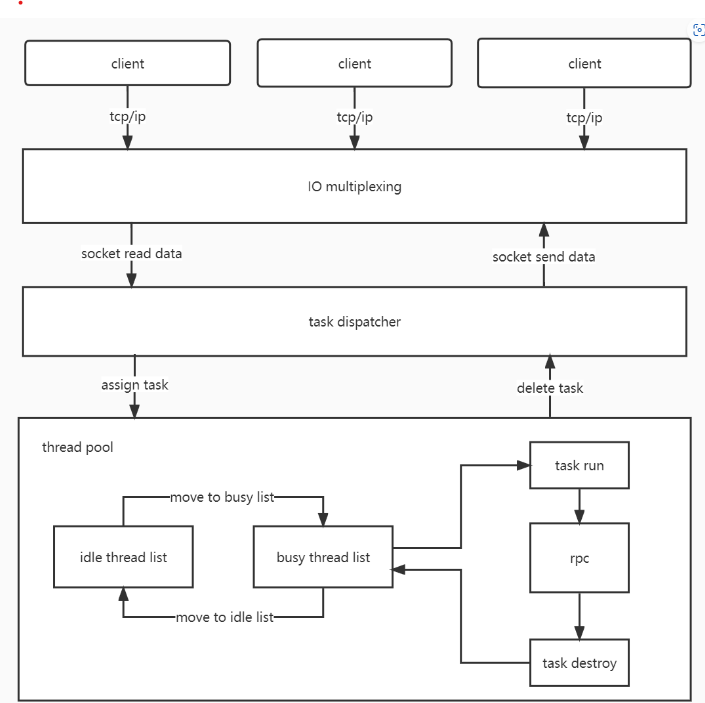

# C++ RPC Framework


## 介绍
- [x] 操作系统：Linux
- [x] 编程语言：C++14
- [x] 完全独立：不依赖任何第三方库
- [x] 高性能：微秒级响应
- [x] 高并发：单机百万连接
- [x] IO多路复用：epoll
- [x] 连接池
- [x] 线程池
- [x] 用法简单

## 整体架构


## 编译运行
```
mkdir build && cd build
cmake ..
make

./server
./client
```
